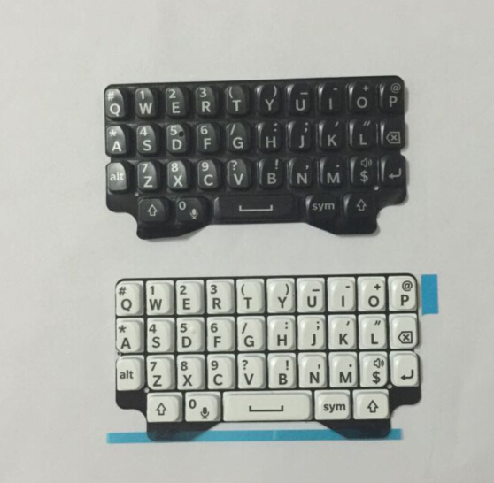
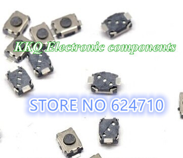

BB-Keyboard
=================

> A complete module that acts as a SPI/I2C keyboard, which uses OEM surplus Blackberry keyboards and micro switches.

### Bill of materials

* [Blackberry Q5 Keyboard](http://www.aliexpress.com/item/New-Original-For-Blackberry-Q5-Housing-Keypad-Keyboard-Qwerty-Black-Or-White-Free-Shipping/32337504795.html) ($3)
  
* [3x4x2mm SMD Tactile Switches](http://www.aliexpress.com/item/200PCS-3-4-2MM-3X4X2mm-SMD-Tact-2P-miniature-micro-switch-button-switch-new-Original-Push/32595638808.html) ($4)
  
* TBD...

This is a work-in-progress.
